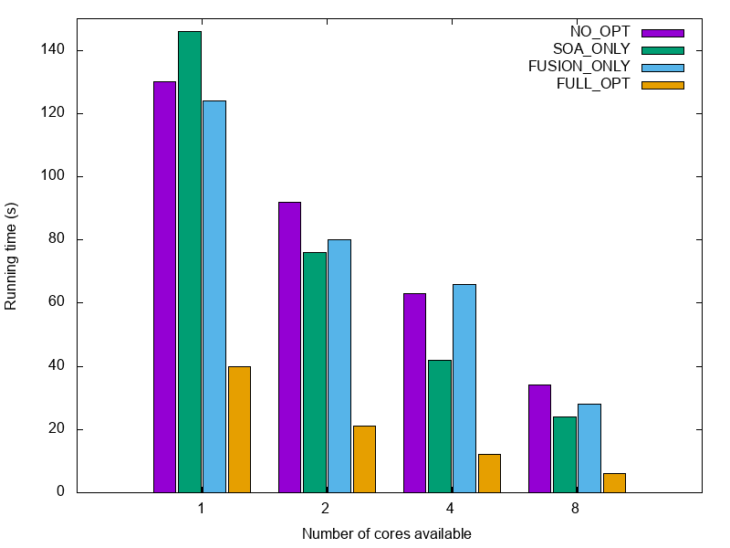

# Evaluation
 
To illustrate the usefulness of the optimizations we presented, we evaluate them on a series of practical examples. In the following section we present benchmark results that show how `SoA` and loop fusion interefere positively.

## Methods
For our experiments, we use two apps (TPCHQ1 & TPCHQ6) from the TPC-H benchmark[^1Eval] suite implemented in Delite. We compile each app four times with one of the following configuration:

- No loop fusion & no `SoA`
- Only `SoA`
- Only loop fusion
- Both loop fusion & `SoA` enabled

All of the other configuration parameters remain unchanged. 
We then run each executable with 1, 2, 4 or 8 cores. 
We use Delite's internal mechanism to measure the execution times. 
Out of five runs per configuration, we keep only the median. 

We report our results in the tables and charts below. All of the execution times are given in second. The configuration with no optimization is used as a baseline for the speedups tables.

## Results

|    cores |      soa |   fusion |     full |
| -------- | -------- | -------- | -------- |
|        1 |    0.59x |    0.93x |    3.05x |
|        2 |    0.73x |    0.80x |    3.60x |
|        4 |    0.89x |    0.91x |    4.95x |
|        8 |    1.60x |    2.20x |    7.46x |
: Optimization speedups for TPCHQ1

|    cores |      soa |   fusion |     full |
| -------- | -------- | -------- | -------- |
|        1 |    0.89x |    1.05x |    3.22x |
|        2 |    1.21x |    1.15x |    4.36x |
|        4 |    1.49x |    0.95x |    5.47x |
|        8 |    1.43x |    1.19x |    5.21x |
: Optimization speedups for TPCHQ6

[^1Eval]: http://www.tpc.org/tpch/default.asp

## Discussion

**TODO: Improve this section**

- neither SoA nor loop fusion is always beneficial on it's own
- both combine always are, and by a huge margin